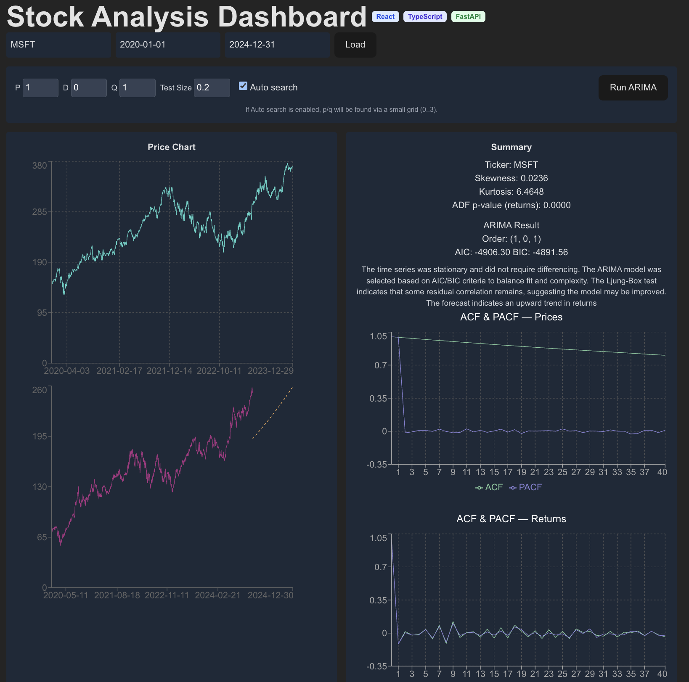

# Fintech
Projects related to fintech and my personality ! 

### a workflow should look like :

- **Collect data** (price, fundamentals, alternative, macro, order book).
- **Clean & align** (handle missing data, adjust for corporate actions).
- **Feature engineering** (technical indicators, sentiment, macro scores).
- **Model selection** (time series, NLP, RL).
- **Backtesting** with realistic assumptions.
- **Deploy** with risk controls.
- **Monitor** and retrain to adapt to market changes.

## Financial Dashboard from week 2 : https://fintech-43ngfa730-tush05tgsinghs-projects.vercel.app/

## 👩‍💻 Author

Tushita Singh
ML + Software Engineer
GitHub: https://github.com/tush05tgsingh

LinkedIn: https://www.linkedin.com/in/tushita-singh/
